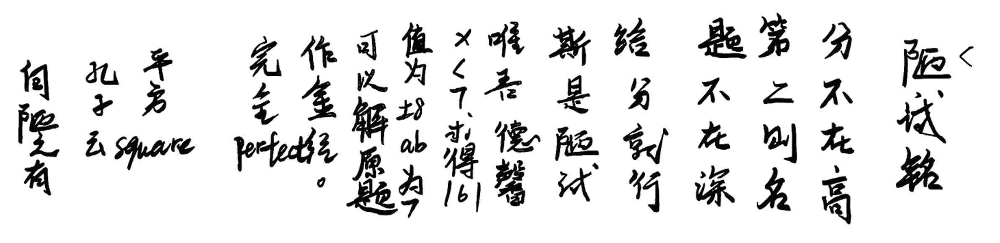
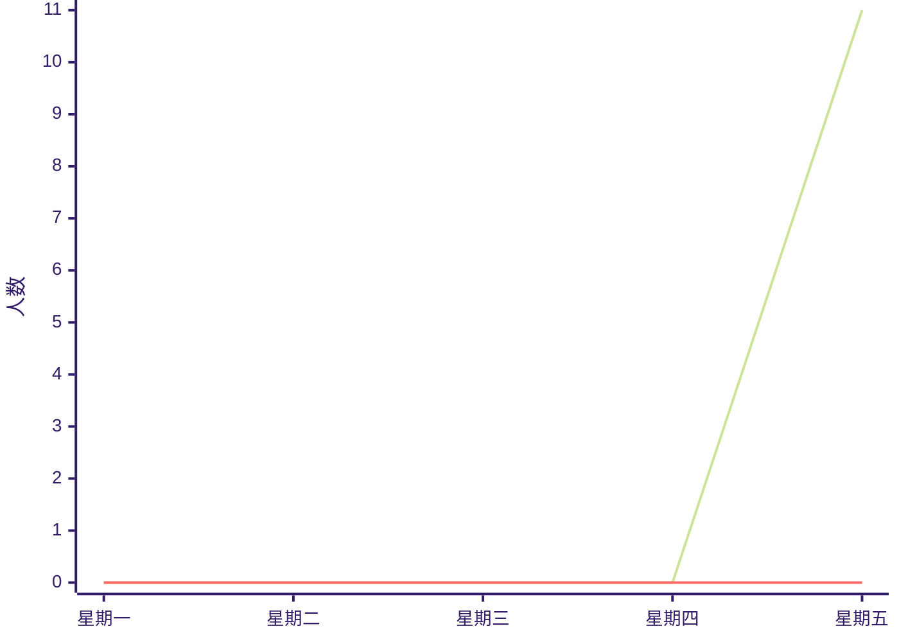

<b>周恩来周报 </b><b>第七期</b><b>
</b><b>2025.4.19</b>

平时不努力&nbsp;考试干着急 
急得满头汗&nbsp;考个大零蛋 ——孙佳铭

 

## 陋试铭
> 苏州市第一初级中学校 初一（1）班 李军昊

分不在高，第二则名。题不在好，给分就行。斯是陋试，唯吾德馨。
x&lt;7，求得161。值为±8，ab=7。可以解原题，作金经。完全perfect，平方square.
孔子云：何陋之有？

吴铭作

 

## 草履虫的启示：从微小胞肛到人生大境界

——致全体同学的一封科学励志信

> 苏州市第一初级中学校 初一（1）班 李军昊

### 自然界的奇迹工程师

在显微镜的幽蓝光晕下，草履虫这个仅0.3毫米的单细胞生物，正以它后端的胞肛演绎着生命的史诗。这个直径不足2微米的圆形小孔，每日要完成**30次以上的排遗作业**，其效率堪比纳米级垃圾处理厂。更令人惊叹的是，胞肛周围收缩泡的协同运作，展现出比人类排污系统更精密的“自洁机制”——没有懈怠，没有堵塞，只有永恒精准的代谢律动。

当我们在实验室记录草履虫每小时排出食物残渣的精确数据时，是否想过？这个没有大脑的生物，竟把排泄这样"不体面"的生理活动，变成了诠释生命尊严的仪式。它的胞肛从不因任务卑微而敷衍，正如真正的学者不会因课题微小而轻视。

### 微观世界里的奋斗哲学
草履虫的胞肛永远遵循着**20 秒工作周期**，这种刻在DNA里的时间管理，让现代职场精英都相形见绌。它不知道什么叫"拖延症"，只懂得每个瞬间都是生存的战场。

即使在实验员故意提升培养液浊度的逆境中，胞肛的收缩频率依然稳定在**15-18 次/分钟**。这种在污染环境坚守本职的精神，恰似我们在题海中保持解题节奏的写照。

通过胞肛排出的废物，会成为其他微生物的营养源。这提醒我们：今日绞尽脑汁解出的错题，终将化作明日思维跃迁的阶梯。

### 成为自己的生命工程师
看着草履虫胞肛永不停歇的收缩，让我们扪心自问：

- 当这个单细胞生物都在严格执行它的"代谢KPI"，我们有什么理由在晨读课时昏昏欲睡？
- 当它的细胞膜能自动识别有用物质与废物，我们是否也该培养甄别知识重点的"学术胞肛"？
- "题目再难，难道比草履虫在酸性环境生存还难？"

### 渺小中的伟大

同学们，在这个直径不足头发丝十分之一的胞肛面前，我们见证了一个宇宙级的真理：生命从无高下之分，只有境界之别。当草履虫用它的胞肛书写单细胞生物的传奇，我们更该以笔为矛，在知识的原野上策马奔腾。

愿你们如胞肛般精准自律，似草履虫般永不言弃。待到期末考试时，且看诸位如何将这份微观世界的启迪，转化为答卷上的星辰大海！

## 新 陋试铭

> 苏州市第一初级中学校 初一（1）班 李军昊

分不在高，通透则灵；题不在多，彻悟则明。斯是陋试，惟吾求真。草稿演春秋，答卷写丹心。谈笑有鸿儒，往来无白丁。可以证几何，论古今。无喧嚣之乱耳，无功利之劳形。北大未名湖，清华荷塘月。学子云：何陋之有？

最后，借用《新 陋试铭》的智慧："分不在高，通透则名；题不在多，悟
透则灵。" 愿你们既能从草履虫的微观哲学中汲取力量，也能在孙佳铭的幽默
警句里保持清醒。

## 本周默写初一一班全对人数（来源：班级群）

> 图例
> 
> —— 英语全对人数
> 
> —— 语文全对人数

## 四月、五月调休日历

<table>
    <thead>
    <tr>
    <td>星期日</td>
    <td>星期一</td>
    <td>星期二</td>
    <td>星期三</td>
    <td>星期四</td>
    <td>星期五</td>
    <td>星期六</td>
    </tr>
    </thead>
    <tbody>
    <tr>
    <td style="background: var(--vp-c-red-soft)">27</td>
    <td style="background: var(--vp-c-yellow-soft)">28</td>
    <td style="background: var(--vp-c-yellow-soft)">29</td>
    <td style="background: var(--vp-c-yellow-soft)">30</td>
    <td style="background: var(--vp-c-indigo-soft)">1</td>
    <td style="background: var(--vp-c-green-soft)">2</td>
    <td style="background: var(--vp-c-indigo-soft)">3</td>
    </tr>
    <tr>
    <td style="background: var(--vp-c-indigo-soft)">4</td>
    <td style="background: var(--vp-c-green-soft)">5</td>
    <td style="background: var(--vp-c-yellow-soft)">6</td>
    <td style="background: var(--vp-c-yellow-soft)">7</td>
    <td style="background: var(--vp-c-yellow-soft)">8</td>
    <td style="background: var(--vp-c-yellow-soft)">9</td>
    <td style="background: var(--vp-c-red-soft)">10</td>
    </tr>
    <tr height="20px"></tr>
    <tr>
    <td>图例</td>
    <td style="background: var(--vp-c-red-soft)">调休上课</td>
    <td style="background: var(--vp-c-yellow-soft)">正常上课</td>
    <td style="background: var(--vp-c-green-soft)">调休放假</td>
    <td style="background: var(--vp-c-indigo-soft)">正常放假</td>
    </tr>
    </tbody>
</table>
